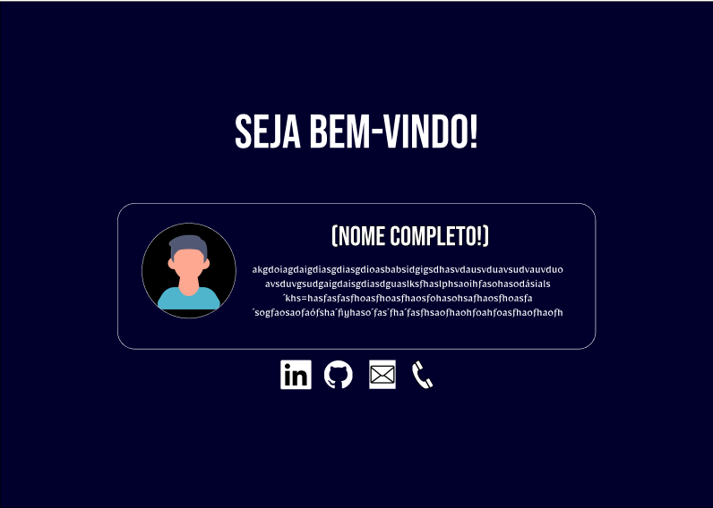
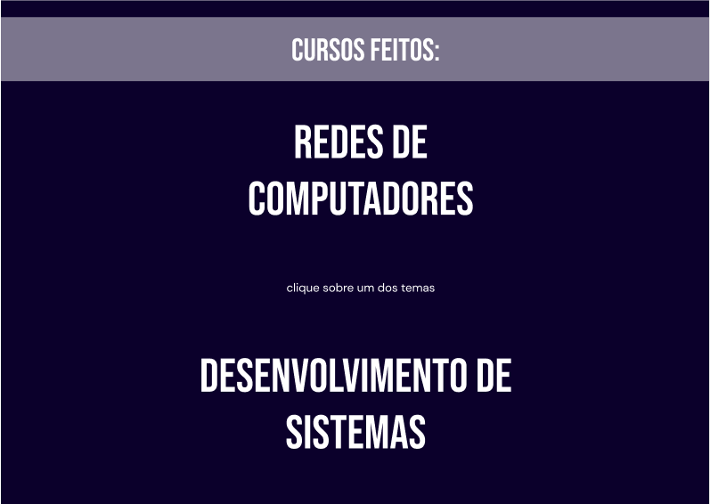
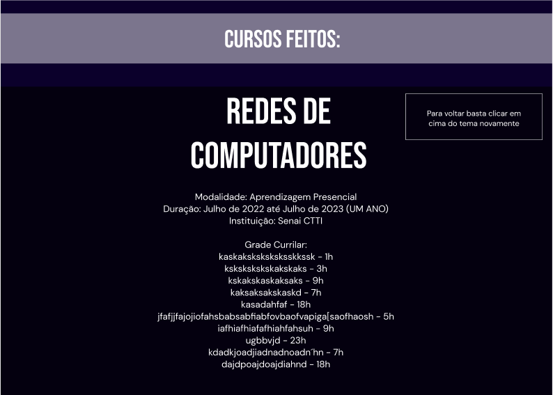
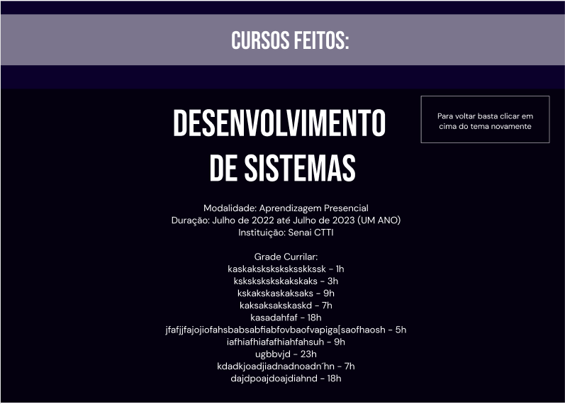
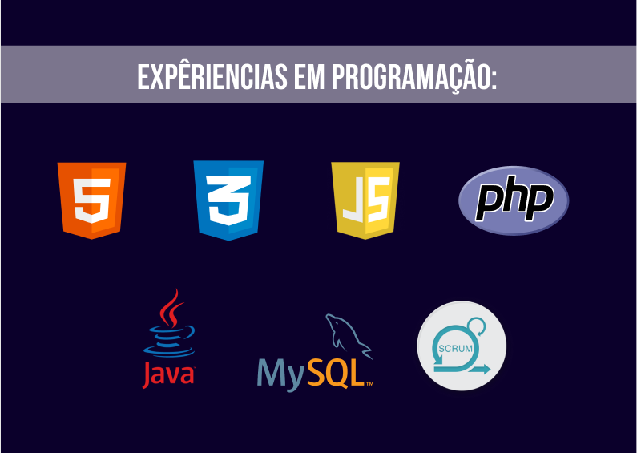
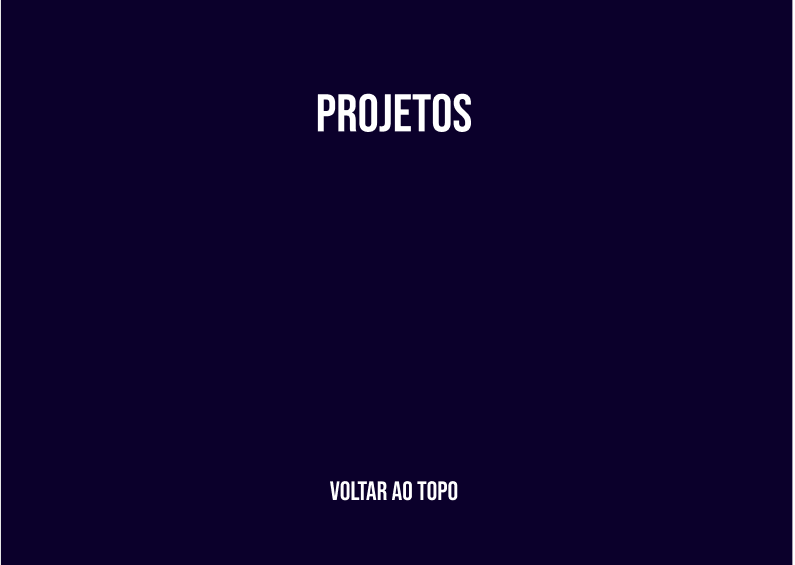

# Portfolio #
Este portfolio foi projetado pensando em apresentar minhas habilidades, cursos, diplomas, conhecimentos e qualificações voltada para T.I. em especial para a área de Desenvolvimento de Software e Infraestrutura.
Além disso, o projeto tem informações para contato, além de projetos de programação realizados por mim! O projeto ainda conta com uma versão para _Desktop_ e uma _Responsiva_ para Mobile, espero que gostem :)

## Ferramentas Utilizadas ##
As ferramentas utilizadas nesse projeto são bem simples já que esse é um site _Landing Page_ mas nem por causa disso, eu deixei de tentar utilizar todas as ferramentas cabíveis e minha criatividade nessa hora!
Começando pelo protótipo, o site foi projetado inicialmente usando o __Figma__, site utilizado para a realização de protótipo de softwares e aplicações WEB (como pode ser visto nas imagens abaixo).

 

O projeto foi feito principalmente utilizando __HTML__ e __CSS__ para realizar toda a estrutura e customizações do site. Como o site será atualizado constantemente com futuros cursos, conhecimentos e habilidades que eu vou adquirir, o site constantemente têm _Features_ novas e atualizações das antigas por meio de __Versionamento Git__.

